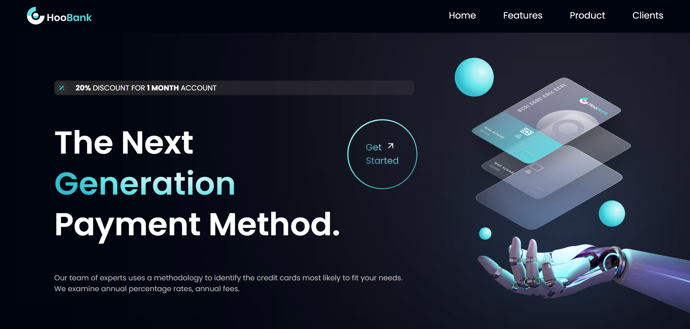

<h1 align="left">Digital Bank´s Website (frontend)</h1>

    

<h3 align="left">This frontend project is dedicated to the development of a sleek and responsive website using cutting-edge technologies—React, Vite, and Tailwind CSS. The primary goal is to create a visually appealing, user-friendly interface that seamlessly integrates dynamic components and modern styling to enhance the overall web experience.</h3>

- 💻 This project is available at [https://bank-app-clone.vercel.app](https://bank-app-clone.vercel.app)

- 👨‍💻 All of my projects are available at [https://enrique-spinelli-port.vercel.app](https://enrique-spinelli-port.vercel.app)

- 📫 How to reach me **enriquespinelli.coder@gmail.com**
  
 

## 🗒️ Key Features:

<h4>React Components for Dynamic UI:</h4>

Employ React's component-driven architecture to create a dynamic and interactive user interface.
Develop reusable components for features like navigation menus, image carousels, and interactive forms.

<h4>Vite for Swift Development:</h4>

Utilize Vite's rapid build times and hot module replacement to accelerate the development workflow.
Leverage Vite's seamless integration with React to enhance code organization and modularization.

<h4>Tailwind CSS Styling for Efficiency:</h4>

Harness the utility-first approach of Tailwind CSS for efficient and consistent styling.
Leverage Tailwind's extensive set of utility classes to streamline the design process and ensure a cohesive visual identity.

<h4>Responsive Design for Cross-Device Compatibility:</h4>

Implement a responsive design strategy to optimize the website for various screen sizes.
Utilize Tailwind CSS's responsive utilities to create layouts that adapt seamlessly to different devices.

 

## 🌐 Socials:
 

